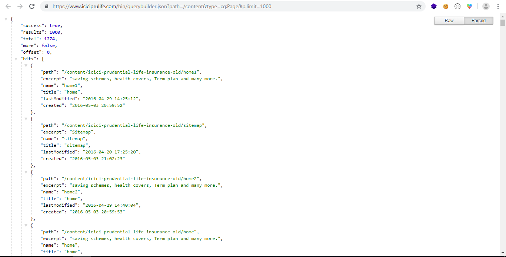

H**[ello, Friend!](https://en.wikipedia.org/wiki/Eps1.0_hellofriend.mov)** Today I want to share some information about general security issues which I found in sites developed with Adobe Experience Manager **(AEM)**. AEM is a leader in the **Web Content Management Platform** and it is proved with **Gartner**’s past few years’ magic quadrants. It is easy to manage content, assets, and websites with AEM and takes less time to deliver your website. Also, it is **Omnichannel** so, you can easily share your content across all your devices.
  
Personally, I love AEM and working with it from last 1 year (although, I have started career 1 year back only 😛).
  

<blockquote class="pullquote text-italic text-inherit">

AEM is a powerful tool which you can customize to a great extent but, **["With great power comes great responsibility"](https://en.wikipedia.org/wiki/Uncle_Ben)** and here sometimes AEM Administrators fail. AEM is complex as it is built on many frameworks with custom modules to glue these different frameworks and when there is complex stuff, there can be a chance for security bugs.

</blockquote>

<blockquote class="pullquote blockquote text-italic text-inherit">

So, if you ignore security, **[Mr. Robot](https://en.wikipedia.org/wiki/Mr._Robot)** and **fsociety** will definitely get into your home without your realization.

</blockquote>

So, let’s start with the security issues I found:
  

# **First Thing First**

If your AEM Administrator, please go through the [AEM’s Security checklist](https://helpx.adobe.com/in/experience-manager/6-4/sites/administering/using/security-checklist.html) and follow it strictly and never ever forget to use **“nosamplecontent”** with **“publish”** mode.
  
If you are not using **“nosamplecontent”** then, you can see below what will happen:
  

This issue becomes big when users available with these sample websites are still production server as people know the default passwords for these sample users. They can try to login with these credentials with **Basic Auth** setup in **[Postman](https://www.getpostman.com/)** but, guess what AEM login page is available 😋.

Sometimes, even **/login.html** path is not blocked on Dispatcher and many developers forget to select **Account Locking option** in Administration Console. So, Brute Force is possible here.

I also found on one website that Replication Agent’s path (**/etc/replication/agents.publish.html**) is not blocked. But I will not disclose the name of that website as I have already reported them a issue.

So, before going further, please check for these paths and block them on the dispatcher.
  

# Elementary, my dear JSON

As AEM is built on a **Sling Framework** and it can export data in **JSON** format easily, sometimes just replacing .html extension of website’s page with .json will let you know at what date and time it is modified. Adding extra **/jcr:content.json** will tell you who authored this page and some metadata or details which are on the page node.

Sometimes it’s okay and not a big security threat as it just a data which is intended to be public. But, sometimes business email ids are stored in AEM which can expose the business people email ids who are managing the content for the website. As it is not possible to disable the JSON rendering (which is more like a feature rather than an issue). We can take preventive measures to protect our data, like limiting **JSON Max result size** in **Apache Sling GET Servlet configuration** and all these details are already added in AEM Security checklist.

This is the small problem and will not hurt you much, but what if somehow end user executes query and get your entire repository and check what is there which is accessible to an anonymous user. This problem is there with many websites and can be seen directly using **/bin/querybuilder.json** path. Here, users can execute a query in the repository by passing the query parameters in URL.

If it is not working directly then confuse the Sling with the following path:

**/bin/querybuilder.json.servlet.css**

With this magic tool, I found that on one website anonymous user has the access to **/apps** and there I found the treasure of different **OSGI Configurations** filled with **Database details**, **AMP Page Server details**, **Solr Server detail**, and the most precious gem was **Marketo API configuration** with **Marketo Client Secret Key** stored as plain text.

I got the above package from the same website as the anonymous user has the access to **/etc/packages**. But now these issues are reported and resolved. Now they have a more secure site than before.

So, the moral of the story is to manage **anonymous user’s access very seriously** and use **encryption** while storing the sensitive data in OSGI Configurations (Check **Crypto Support** in AEM Web Console under Main -> Crypto Support). Also, try to block querybuilder on the dispatcher.

<blockquote class="pullquote blockquote text-italic text-inherit">

**TIP:** _First block all the access on the dispatcher and then give access one by one._

</blockquote>

## **Conclusion:**

AEM is superb and I really love it. Just check your security checklist strictly and keep it updated with **CVE database** ([https://www.cvedetails.com/vulnerability-list/vendor_id-53/product_id-33138/Adobe-Experience-Manager.html](https://www.cvedetails.com/vulnerability-list/vendor_id-53/product_id-33138/Adobe-Experience-Manager.html)). Also, keep your AEM instance updated with Adobes’ Security patches and before going live try to do some penetration testing and general security tests.

**P.S.** _Keep sharing your security issues with communities._
