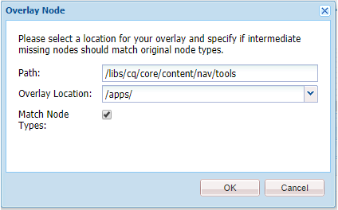
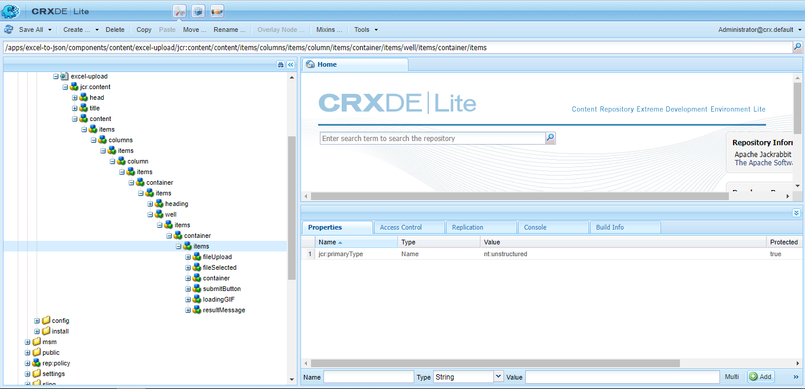

H**[ello Friend!](https://en.wikipedia.org/wiki/Eps1.0_hellofriend.mov)** Have you ever wanted to build your custom menus under **_AEM Tools_** like **ACS AEM [Commons](https://adobe-consulting-services.github.io/acs-aem-commons/)** or **[Tools](https://adobe-consulting-services.github.io/acs-aem-tools/)**, then this story is for you!

&nbsp;

Here, I have developed a **[XLS/XLSX to JSON Converter tool](https://github.com/vsr061/aem-excel-to-json)** which converts Excel file to a JSON and stores in JCR.

&nbsp;

> _Code will be available **[here](https://github.com/vsr061/aem-excel-to-json)**_

&nbsp;

In this tutorial we will learn about two major concepts which get used while _customizing_ AEM

- **Sling Resource Merger**

- **Granite UI**

&nbsp;

So, let’s get started.

&nbsp;

## **Sling Resource Merger**

&NewLine;

The [Sling Resource Merger](https://helpx.adobe.com/in/experience-manager/6-4/sites/developing/using/sling-resource-merger.html) provides services to access and merge resources. It provides diff (differencing) mechanisms for both:

&nbsp;

1.  **_Overlays:_** For overlays the resource delivered is an aggregate of the resources and properties retrieved, depending on search paths that can be defined.In a standard installation the primary defaults are **_/apps_**, **_/libs_** — so the content of **_/apps_** has a higher priority than that of **_/libs_** (i.e. it _overlays_ it). Means if you have a same node under **_/apps_** as that of under **_/libs_**, then AEM will read the results from **_/apps_**

2.  **_Overrides:_** It overrides of component dialogs for the touch-enabled UI (**cq:dialog**), using the resource type hierarchy (by means of the property **sling:resourceSuperType**).

&nbsp;

> **The goal for using the Sling Resource Merger in AEM is to:**
>
>ensure that customization changes are not made in **/libs**.
>
>This is because the content of **/libs** is overwritten the next time you upgrade your instance (and may well be overwritten when you apply either a hotfix or feature pack).

&nbsp;

for our tutorial we will use **_Overlays_** to overlay the AEM Tools node under **_/libs_** and create a similar node structure under **_/apps_**

&nbsp;

It’s easy and can be done with one **right-click** on the following path and then select **Overlay Node …**

&nbsp;

So, it will create similar node structure as shown below:

&nbsp;

Now, we can add custom nodes here to add our Menu under Tools. So, to add new item to the Menu List, we can add a node of type **nt:unstructured** or a folder. I have added a folder of type **sling:OrderedFolder.** The next part is to add **_id_** and **_jcr:title,_**

1.  **id:** Here, id should be **unique**( The recommended value is hierarchical separated by “-“. e.g. “**cq-commerce-report**”)

2.  **jcr:title:** Renders the Title of the Menu Item.

Now, to create an actual tool option, we will add one more **nt:unstructured** node with following properties:

1.  **href:** Location of the **Tool’s landing page** (generally **cq:Page** under **/apps** or **/content**)

2.  **target: href** target attribute

3.  **icon:** You can give a name of a available icon in the [Coral UI](https://helpx.adobe.com/experience-manager/6-4/sites/developing/using/reference-materials/coral-ui/coralui3/Coral.Icon.html#availableIcons)

4.  **id:** Here, id should be **unique**( The recommended value is hierarchical separated by “-“. e.g. **"cq-commerce-report"**)

5.  **jcr:description:** Description for your tool

6.  **jcr:title:** Title for your tool

## **Granite UI**

&NewLine;

> Granite Documentation will be available [here](https://helpx.adobe.com/experience-manager/6-4/sites/developing/using/reference-materials/granite-ui/api/jcr_root/libs/granite/ui/index.html)

It’s a time to develop the Landing Page for our tool and this can be done in many ways, but still I have used Granite UI for the following reasons:

1.  It’s easy; just like creating your Touch UI Dialog with LEGO® Architecture.

2.  Easy to maintain.

3.  Less or no code required.

&nbsp;

To create Landing Page, I have created a AEM multi-module maven project and added a page under **_/apps/excel-to-json/components/content_** developed using **[Granite UI Shell Page](https://helpx.adobe.com/experience-manager/6-4/sites/developing/using/reference-materials/granite-ui/api/jcr_root/libs/granite/ui/components/shell/page/index.html)** component.

&nbsp;

I have added the **Granite Server Side components** like **[FileUpload](https://helpx.adobe.com/experience-manager/6-4/sites/developing/using/reference-materials/granite-ui/api/jcr_root/libs/granite/ui/components/coral/foundation/form/fileupload/index.html)** and **[PathField](https://helpx.adobe.com/experience-manager/6-4/sites/developing/using/reference-materials/granite-ui/api/jcr_root/libs/granite/ui/components/coral/foundation/form/pathfield/index.html)** to upload the Excel file and to select the path to store converted JSON.

&nbsp;

Excel file gets uploaded to a **[Servlet](https://github.com/vsr061/aem-excel-to-json/blob/master/core/src/main/java/com/excel/json/core/servlets/ExcelToJSONServlet.java)** and then it converts the table to JSON format, where each _row_ gets converted to a _JSON object_ with _column name_ as _property_ and cell value as the _property value_.

&nbsp;

### **Granite UI Shell Page**

&NewLine;

Granite Shell Page is the generic page to render Shell. So, it will get rendered as shown below:

&nbsp;

To know all the Shell page properties, you can refer **[this](https://helpx.adobe.com/experience-manager/6-4/sites/developing/using/reference-materials/granite-ui/api/jcr_root/libs/granite/ui/components/shell/page/index.html)** page. I will focus on some main properties required to render the page:

&nbsp;

**head:** A folder to specify the content of `<head>` of the page. Its child resources are iterated and included as is. You need to use **[IncludeClientlibs](https://helpx.adobe.com/experience-manager/6-4/sites/developing/using/reference-materials/granite-ui/api/jcr_root/libs/granite/ui/components/coral/foundation/includeclientlibs/index.html)** component to add your js and css libraries. Don’t forget to add **“granite.ui.coral.foundation”** category.

&nbsp;

**title:** The component to render the title.

&nbsp;

&nbsp;

**title** gets rendered to as shown below

&nbsp;

&nbsp;

**content:** The actual content of the page. Here, you can add _sling:resourceType_ for rendering script or use Granite UI Components as shown below:

&nbsp;

> **Final Page:**

## **Code:**

[Github](https://github.com/vsr061/aem-excel-to-json)

&nbsp;

> Check my other stories **_[here](/blogs)_**

&nbsp;

## **References:**

1.  [Granite UI Documentation](https://helpx.adobe.com/experience-manager/6-4/sites/developing/using/reference-materials/granite-ui/api/jcr_root/libs/granite/ui/index.html)

2.  [Sling Resource Merger](https://helpx.adobe.com/in/experience-manager/6-4/sites/developing/using/sling-resource-merger.html)
