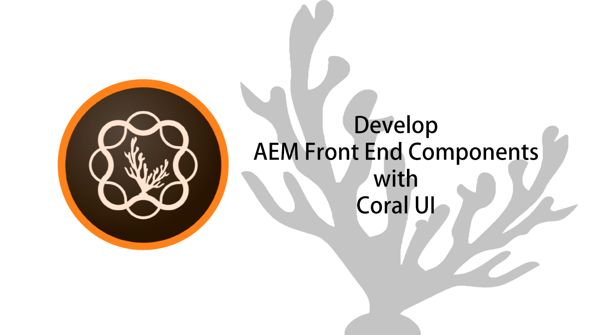
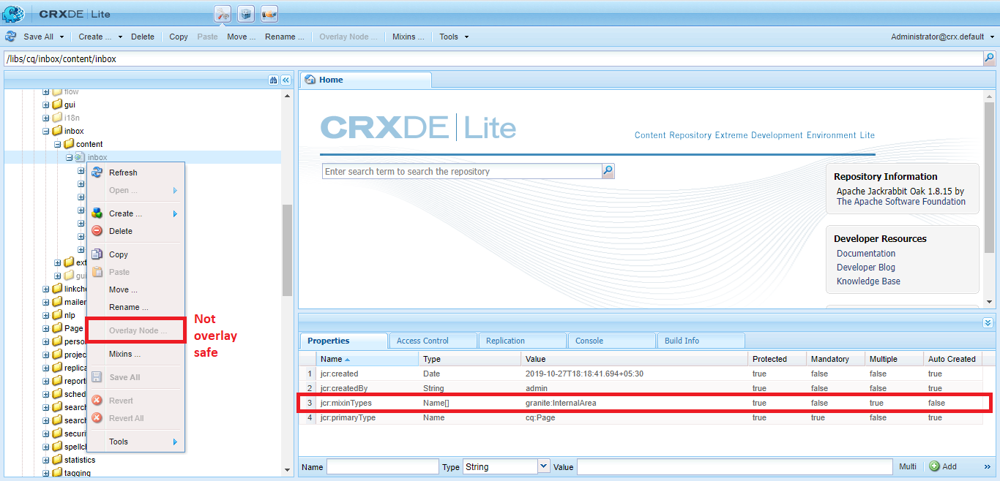
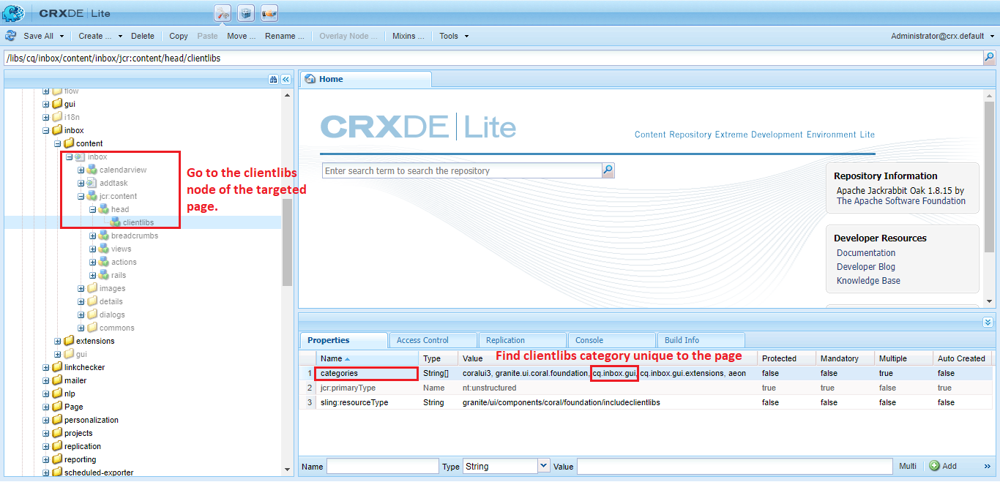
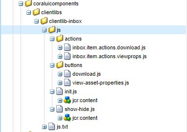
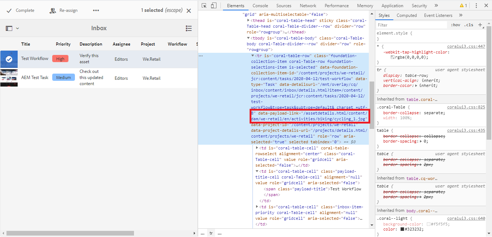

<span class="h1">C</span>**[oral UI](https://helpx.adobe.com/experience-manager/6-5/sites/developing/using/reference-materials/coral-ui/coralui3/index.html)** is a library of touch-first web components, used to ease the work of a front end developer. All components build in Coral UI are simple to use and responsive. These components help to keep the look and style of the platform uniform.

&nbsp;

> **You can find Coral UI cilentlibs under:**
>
> **_Coral UI2:_** /libs/clientlibs/granite/coralui2
>
> **_Coral UI3_**: /libs/clientlibs/granite/coralui3
>
> **_Also, here are the clientlibs categories for Coral UI:_**
>
> **_Coral UI2:_** granite.ui.foundation, granite.ui.foundation.admin, coralui2
>
> **_Coral UI3:_** granite.ui.coral.foundation, coralui3

&nbsp;

---

&nbsp;

## 🤔 Why use Coral UI?

&NewLine;



We can add different components on any AEM UI page/toolbar using **[Granite Server Side Components](https://helpx.adobe.com/experience-manager/6-4/sites/developing/using/reference-materials/granite-ui/api/jcr_root/libs/granite/ui/index.html).** We can simply overlay the respective node in AEM and add a custom component node in it ([checkout for more information](/2019/08/10/Create_Custom_AEM_Menu_Tools_with_Granite_UI_Shell/)).

But, Some nodes in AEM are not safe to overlay **_(granite:FinalArea, granite:InternalArea)_** like _/libs/cq/inbox/content/inbox_, /libs/cq/workflow/admin/console/content/instances, etc 😥.

So, to add our custom components like buttons, drop-downs, text fields, etc., we can utilize the existing Coral UI library and initialize these components using javascript and then add respective toolbar clientlibs category to load our js with the OOTB clientlibs 😊.

Even you can override existing js event handlers with this and add some extra features to buttons or components 🤩.

In this tutorial, we will add two buttons in the AEM Inbox action bar.

&nbsp;

## Add buttons in the AEM Inbox action bar

&NewLine;

- **Step 1:** Get the clientlibs category of the target page. We need to create a
  clientlibs folder in our project with this category. So, it will get loaded after the targeted page’s clientlibs.



- **Step 2:** Create a clientlibs folder with the category received from **Step 1**

![Here, I have created the folder with categories(String[]) = cq.inbox.gui, which is same as the category we received in Step 1](../media/2020-04-15-Develop-Front-End-Components-with-AEM-Coral-UI/p3.png)

- **Step 3: _Start Coding with the Coral UI library!_** So, before starting with actual code we will understand the folder structure and what each file is for. Check the following image of the folder structure:
  

  1.  **actions:** This folder has JS code to handle button click events. This is based on [Granite UI client-side JS components](https://helpx.adobe.com/experience-manager/6-4/sites/developing/using/reference-materials/granite-ui/api/jcr_root/libs/granite/ui/components/coral/foundation/clientlibs/foundation/index.html) called [foundation-collection-action](https://helpx.adobe.com/experience-manager/6-4/sites/developing/using/reference-materials/granite-ui/api/jcr_root/libs/granite/ui/components/coral/foundation/clientlibs/foundation/js/collection/action/index.html).

  2.  **buttons:** It contains the [Coral UI library](https://helpx.adobe.com/experience-manager/6-5/sites/developing/using/reference-materials/coral-ui/coralui3/Coral.Button.html) code to initialize button components.

  3.  **init.js:** It initializes the buttons’ code written in the above folder.

  4.  **show-hide.js:** As we are developing these buttons for assets, this show-hide.js handles the item select event in AEM Inbox and show the buttons if the item’s payload in under DAM, else hide the buttons.

&nbsp;

Now, let’s talk about the individual code:

&nbsp;

1.  **foundation-collection-action:**

```javascript
(function(window, $, URITemplate) {
  'use strict'

  $(window)
    .adaptTo('foundation-registry')
    .register('foundation.collection.action.action', {
      name: 'cq.inbox.download',
      handler: function(name, el, config, collection, selections) {
        let linkAttributeName = config.data.linkAttributeName
        let payloadLink = $(selections)
          .data(linkAttributeName)
          .replace(/\/assetdetails.html|\/jcr:content.*/, '')

        let url = payloadLink

        if (config.data.target) {
          window.open(url, config.data.target)
        } else {
          window.location = url
        }
      },
    })
})(window, Granite.$, Granite.URITemplate)
```

&nbsp;

Granite UI has a client-side JS component called **[foundation-collection-action](https://helpx.adobe.com/experience-manager/6-4/sites/developing/using/reference-materials/granite-ui/api/jcr_root/libs/granite/ui/components/coral/foundation/clientlibs/foundation/js/collection/action/index.html).** `foundation-collection-action` is a control to perform an action related to [foundation-selections](https://helpx.adobe.com/experience-manager/6-4/sites/developing/using/reference-materials/granite-ui/api/jcr_root/libs/granite/ui/components/coral/foundation/clientlibs/foundation/vocabulary/selections.html). So, when you select any item in Inbox this event can be handled using `foundation-collection-action` to get selected items easily. `handler` function triggers on the _“click”_ event and passes the selected items ( `selections` ) and `config` (a configuration stored in the button as JSON in the HTML data attribute), which has an action name and other parameters to read data from selected items. For the above code `linkAttributeName` has a value `payloadLink` stored in button configuration to read data from Inbox item that is payload link of the selected item (check button configuration **[code](https://github.com/vsr061/coral-ui-components/blob/65ff4b2a46743bb01891a871cb18e5ef9ffe47b9/ui.apps/src/main/content/jcr_root/apps/coraluicomponents/clientlibs/clientlib-inbox/js/buttons/download.js#L23)).** The action handler will be called when the name matches. A chain of registered actions is created using LIFO (last in, first out) algorithm. So, you can override the default handler easily, just by registering custom handler code later.



**2. Coral UI Button:**

```javascript
let downloadAsset = () => {
  //Create Coral Button Structure:
  let button = new Coral.Button().set({
    label: {
      innerHTML: 'Download Asset',
    },
    variant: 'quiet',
    icon: 'download',
    iconSize: 'S',
  })

  //Action config to handle click event
  /**
   * activeSelectionCount: Visibilty config for single/multiple select
   * if single then visble for single select only
   * data: Data config to for callback action
   */
  let actionConfig = {
    activeSelectionCount: 'single',
    action: 'cq.inbox.download',
    data: {
      linkAttributeName: 'payloadLink',
      target: '_blank',
    },
  }
  $(button).attr(
    'data-foundation-collection-action',
    JSON.stringify(actionConfig)
  )

  //Add Grnaite tracking features
  $(button).attr('trackingfeature')
  $(button).attr('trackingelement', 'download asset')
  $(button).attr('tracking', 'ON')

  //Add exiting inbox classes to align & style button properly:
  //cq-inbox-asset is addded to track element for show/hide functionality
  $(button).addClass(
    'betty-ActionBar-item ' +
      'cq-inbox-asset ' +
      'foundation-collection-action ' +
      'coral-Button--graniteActionBar'
  )

  return button
}
```

&nbsp;

Coral UI has many components and all can be instantiated easily with JS, without adding a hardcoded string of HTML. Learn more about the Coral Button component [here](https://helpx.adobe.com/experience-manager/6-5/sites/developing/using/reference-materials/coral-ui/coralui3/Coral.Button.html).

&nbsp;

**3. Coral UI Action Bar ([init.js](https://github.com/vsr061/coral-ui-components/blob/master/ui.apps/src/main/content/jcr_root/apps/coraluicomponents/clientlibs/clientlib-inbox/js/init.js)):**

```javascript
$(document).ready(function() {
  let actionBar = document.getElementsByClassName('betty-ActionBar')[0]
  //wait till the actionbar is ready
  Coral.commons.ready(actionBar, function() {
    //Get item list for left buttons
    let leftItems = actionBar.primary.items

    //Add custom buttons to the action bar
    leftItems.add({}).appendChild(viewAssetProps())
    leftItems.add({}).appendChild(downloadAsset())
  })
})
```

&nbsp;

To add these buttons in the Inbox action bar we can use the existing `appendChild()` method and pass the respective buttons. `leftItems` are the buttons which we see on the left side of the action bar like complete, step back, etc. Here, [Coral.commons.ready()](https://helpx.adobe.com/experience-manager/6-5/sites/developing/using/reference-materials/coral-ui/coralui3/Coral.commons.html#Coral.commons:.ready) checks whether Coral components and all nested components are ready, which assures their `_initialize` and `_render` methods have been called. If so, the provided callback function is executed.

&nbsp;

**4. Hide buttons for payload other than assets:**

```javascript
$(document).on('click', '.foundation-collection-item', function(item) {
  let assetPath = '/content/dam'
  let selector = '.foundation-selections-item'
  let linkAttributeName = 'payloadLink'
  let row = $(item.target).closest(selector)
  let payloadPath = $(row).data(linkAttributeName)

  if (payloadPath && payloadPath.indexOf(assetPath) !== -1) {
    $('.cq-inbox-asset').removeClass('foundation-collection-action-hidden')
  } else {
    $('.cq-inbox-asset').addClass('foundation-collection-action-hidden')
  }
})
```

&nbsp;

This is a simple _“click”_ event handler which gets triggered when we click on the item’s checkbox. As these buttons are specifically for assets, if the selected item payload is not under `/content/dam` then, these buttons should not be visible.

&nbsp;

## Conclusion:

Coral UI is a very useful library while developing the front end components which are part of AEM UI. This makes components uniform throughout the platform. Also, code management gets easy as many lines of boilerplate code are avoided.

&nbsp;

## Code:

[Github](https://github.com/vsr061/coral-ui-components)

&nbsp;

> Check my other stories **_[here](/blogs)_**

&nbsp;

## References:

&NewLine;

1.  [Coral UI](https://helpx.adobe.com/experience-manager/6-5/sites/developing/using/reference-materials/coral-ui/coralui3/index.html)

2.  [Granite UI](https://helpx.adobe.com/experience-manager/6-4/sites/developing/using/reference-materials/granite-ui/api/jcr_root/libs/granite/ui/index.html)
